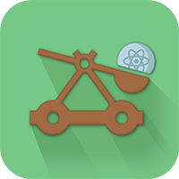

# catapultenv

<table>
  <td>
    
  </td>
  <td>
    Catapult your dependencies without going into the details.
  </td>
</table>

## Install catapultenv

1. Make sure you have these global dependencies

  ```
  sudo pip install virtualenv
  ```

  ```
  sudo npm install -g yarn
  ```

2. Install your catapultenv setup, python and node (via nodeenv)
  ```
  cd catapultenv && virtualenv .
  ```

  ```
  source bin/activate && pip install nodeenv
  ```

  ```
  source bin/activate && nodeenv -p --node=6.9.1
  ```

3. Install your libs
  ```
  cd lib && pip install -r requirements.txt && yarn
  ```

3. Create a binary command that will help you in your project to link your env and trigger local dbs:
  ```
   export VENV_APP=ctp && cp scripts/$VENV_APP.sh /usr/local/bin/$VENV_APP && chmod u+x /usr/local/bin/$VENV_APP
  ```

## Dev during your project

1. link
```
catapultenv link
```

2. data
```
catapultenv data
```
